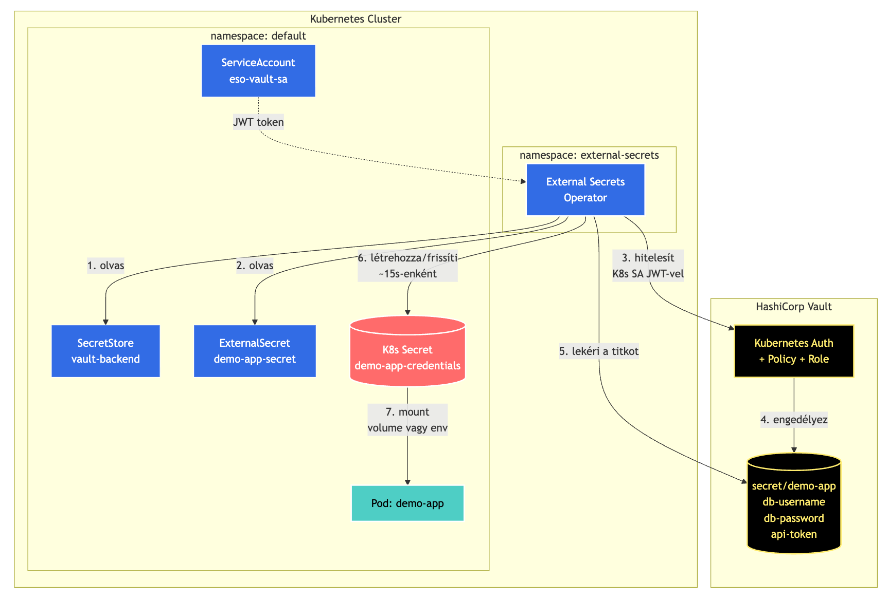

<!-- _class: cover -->
<!-- _footer: '' -->

# Kubernetes alkalmazások konfigurációja


Back István Levente
Balogh Efraim
Lazar Emanuel

**Mikroszervíz architektúrák 2026**

---

<!-- _class: rounded -->

# Miről lesz szó?

<br>

1. **ConfigMap** - nem érzékeny konfiguráció kezelése
2. **Secret** - titkos adatok natív K8s megoldása
3. **External Secrets Operator + Vault** - éles környezeti megoldás

<br>

> **A 12-factor app III. alapelve:**
> _"Store config in the environment"_ - válaszd szét a kódot a konfigurációtól.

---

# Miért fontos a konfiguráció szétválasztása?

- Ugyanaz az image fusson **dev / staging / prod** környezetben
- Ne kelljen újraépíteni az image-et csak azért, mert egy érték változik
- A titkok **soha** ne kerüljenek a kódba vagy a Git-be
- A környezet-specifikus értékek **deklaratívan** legyenek kezelve
- **GitOps**-barát: a konfiguráció verziózható, auditálható

---

<!-- _class: section -->


# 1. rész

## ConfigMap

<div class="cover-icons">
  <i class="fa-solid fa-file-code"></i>
  <i class="fa-solid fa-sliders"></i>
  <i class="fa-solid fa-toggle-on"></i>
</div>

---

# Mi az a ConfigMap?

> Namespace-scoped key-value tár nem érzékeny konfigurációhoz.

<br>

- Kulcs-érték párok tárolása a klaszteren belül
- **Nem titkosított** - bárki olvashatja, akinek RBAC joga van rá
- Pod-ok env változóként vagy fájlként érik el
- Maximum **1 MiB** méretkorlát

---

# Milyen problémát old meg?

### ConfigMap előtt:

- Konfiguráció a Docker image-be építve → újraépítés minden változásnál
- Hardcoded értékek a kódban
- Konfiguráció környezet-specifikus build-ekben

### ConfigMap után:

- Egy image, sok környezet
- Deklaratív, verziózható konfig
- Futás közben módosítható (volume mount-tal)

---

<!-- _class: columns2 -->

# Előnyök / Hátrányok

### Előnyök:

- Feature flagek
- Log szintek
- API endpoint URL-ek
- App-specifikus paraméterek
- Nginx konfig fájlok
- Environment azonosítók

<br>
<br>

### Hátrányok:

- Jelszavak, API tokenek
- TLS tanúsítványok
- 1 MiB-nál nagyobb fájlok
- Bináris adatok (kerülendő)
- Bármilyen érzékeny adat

---

# Hogyan működik belül?

1. ConfigMap **etcd** kulcs-érték tárban tárolódik, sima szövegként
2. Pod létrehozásakor a **kubelet** lekéri a tartalmát
3. A pod-ba **kétféleképpen** juthat el:
   - **Environment változó** - pod indulásakor egyszer (statikus)
   - **Volume mount** - fájlrendszerre projektálva, **élőben frissül**
4. Volume mount esetén a kubelet ~30-60 másodpercenként szinkronizál

---

<!-- _class: plugins-ts -->

# ConfigMap létrehozása

### CLI-ből:

```bash
kubectl create configmap app-config \
  --from-literal=APP_ENV=production \
  --from-literal=LOG_LEVEL=info
```

### YAML-ból:

```yaml
apiVersion: v1
kind: ConfigMap
metadata:
  name: app-config
data:
  APP_ENV: production
  LOG_LEVEL: info
```

---

<!-- _class: plugins-ts -->

# Pod-hoz csatolás - env változó

```yaml
apiVersion: v1
kind: Pod
metadata:
  name: demo-pod
spec:
  containers:
    - name: demo
      image: alpine:3.19
      envFrom:
        - configMapRef:
            name: app-config
```

**Figyelem: A pod nem látja az új értékeket módosítás után - restart kell!**

---

<!-- _class: plugins-ts -->

# Pod-hoz csatolás - volume mount

```yaml
spec:
  containers:
    - name: demo
      image: alpine:3.19
      volumeMounts:
        - name: config-vol
          mountPath: /etc/config
  volumes:
    - name: config-vol
      configMap:
        name: app-config
```

**~30 mp után automatikusan frissül, restart nélkül!**

---

# Csatolási módok összehasonlítása

| Mód              | Hot reload | Használat                    | Mire való        |
| ---------------- | ---------- | ---------------------------- | ---------------- |
| **env változó**  | ❌         | `process.env.LOG_LEVEL`      | Statikus konfig  |
| **envFrom**      | ❌         | Összes kulcs env-ként        | Sok érték együtt |
| **volume mount** | ✅         | `/etc/config/LOG_LEVEL` fájl | Dinamikus konfig |

---

# Biztonság és limitációk

- **Nincs titkosítás** - etcd-ben sima szöveg
- **1 MiB** méretkorlát
- `kubectl get configmap` mindenkinek látható, akinek joga van hozzáférni
- **Immutable** flag (K8s 1.19+) - utána nem módosítható

---

# Alternatívák

- **Helm values** - chart-szintű konfigurációkezelés
- **Kustomize overlays** - környezet-specifikus felülírások
- **External config providers** - pl. Spring Cloud Config
- **CRD-alapú konfig** - saját Custom Resource Definition-ök

---

<!-- _class: demo -->


# DEMO 1

## ConfigMap

<div class="cover-icons">
  <i class="fa-solid fa-terminal"></i>
  <i class="fa-solid fa-play"></i>
</div>

---

<!-- _class: section -->


# 2. rész

## Secret

<div class="cover-icons">
  <i class="fa-solid fa-lock"></i>
  <i class="fa-solid fa-key"></i>
  <i class="fa-solid fa-user-shield"></i>
</div>

---

# Mi az a Secret?

> Namespace-scoped key-value tár érzékeny adatokhoz, base64-kódolva tárolva.

<br>

- Hasonló a ConfigMap-hez, de **érzékeny adatokra** szánt
- Az értékek **base64-kódoltak** (nem titkosítottak!)
- Több típus: `Opaque`, `kubernetes.io/tls`, `dockerconfigjson`, stb.
- A pod-ok ugyanúgy érik el, mint a ConfigMap-et

---

# Milyen problémát old meg?

### Secret előtt:

- Jelszavak ConfigMap-ben (nincs típuskülönbség)
- Hardcoded titkok a kódban / image-ben
- TLS tanúsítványok ad-hoc kezelése

### Secret után:

- Külön típus érzékeny adatokra → tooling tudja kezelni
- Memóriában (tmpfs) mountolva, nem lemezen
- RBAC-cel külön kezelhető

---

# ConfigMap vs Secret — mikor mit?

| Adat típusa                    | ConfigMap | Secret |
| ------------------------------ | --------- | ------ |
| Log szint, feature flag        | ✅        | ❌     |
| API endpoint URL               | ✅        | ❌     |
| Környezet neve (dev/prod)      | ✅        | ❌     |
| Adatbázis jelszó               | ❌        | ✅     |
| API kulcs (Stripe, SendGrid)   | ❌        | ✅     |
| TLS tanúsítvány + privát kulcs | ❌        | ✅     |
| Docker registry hitelesítés    | ❌        | ✅     |
| OAuth client secret            | ❌        | ✅     |

---

# Valós életbeli példák

### Mit tárolunk Secret-ben a gyakorlatban?

- **Adatbázis hitelesítés** — PostgreSQL / MySQL / MongoDB jelszó, connection string
- **Külső API kulcsok** — Stripe fizetési kulcs, SendGrid e-mail API token, Twilio SID
- **TLS tanúsítvány** — HTTPS-hez szükséges cert + privát kulcs (`kubernetes.io/tls`)
- **Image pull secret** — privát Docker / GitHub Container Registry hitelesítés
- **JWT aláíró kulcs** — token generáláshoz / validáláshoz használt titkos kulcs
- **OAuth client secret** — Google, GitHub, Microsoft SSO integráció
- **SSH privát kulcs** — Git műveletek, szerver hozzáférés automation esetén

> Mindezek közös tulajdonsága: **kiszivárgásuk közvetlen biztonsági kockázatot jelent.**

---

# Előnyök / Hátrányok

<!-- _class: columns2 -->

### Előnyök (kis projekteknél):

- Adatbázis jelszó dev környezetben
- TLS tanúsítvány tárolása
- Image pull credentials
- Egyszerű API tokenek

<br>
<br>

### Hátrányok (éles környezetben önmagában):

- Multi-cluster setup
- Auditált hozzáférés
- Automatikus rotáció
- Dinamikus credentialek

---

# A nagy félreértés: base64 ≠ titkosítás

```bash
$ echo "SuperSecret123!" | base64
U3VwZXJTZWNyZXQxMjMhCg==

$ echo "U3VwZXJTZWNyZXQxMjMhCg==" | base64 -d
SuperSecret123!
```

**Figyelem: Bárki, akinek `kubectl get secret` joga van, olvashatja a titkokat.**

---

# Hogyan működik belül?

1. Secret szintén **etcd-ben** tárolódik
2. Alapból **NEM titkosított** - encryption at rest külön konfigurálandó
3. A pod-on **tmpfs**-en (memóriában) mountolódik
4. Csatolási módok ugyanazok mint ConfigMap-nél:
   - env változó (statikus)
   - volume mount (dinamikus)

---

<!-- _class: plugins-ts -->

# Secret létrehozása

### CLI-ből:

```bash
kubectl create secret generic db-secret \
  --from-literal=username=admin \
  --from-literal=password='SuperSecret123!'
```

### YAML-ból (base64-kódolva):

```yaml
apiVersion: v1
kind: Secret
metadata:
  name: db-secret
type: Opaque
data:
  username: YWRtaW4=
  password: U3VwZXJTZWNyZXQxMjMh
```

---

# Secret típusok

| Típus                                 | Felhasználás                |
| ------------------------------------- | --------------------------- |
| `Opaque`                              | Általános titok (default)   |
| `kubernetes.io/tls`                   | TLS tanúsítvány + kulcs     |
| `kubernetes.io/dockerconfigjson`      | Docker registry hitelesítés |
| `kubernetes.io/service-account-token` | ServiceAccount token        |
| `kubernetes.io/basic-auth`            | HTTP basic auth             |
| `kubernetes.io/ssh-auth`              | SSH privát kulcs            |

---

# Biztonság és limitációk

- **base64 ≠ titkosítás** - a legnagyobb félreértés
- **etcd plaintext** alapból (encryption at rest külön)
- **`kubectl get secret`** = klaszter szintű kompromisszum
- **Git-be nem rakható** plaintext-ben
- **Nincs natív rotáció** - manuálisan kell frissíteni
- **Nincs audit log** - ki, mikor olvasta?

---

# Alternatívák a natív Secret-en túl

- **Sealed Secrets** (Bitnami) - GitOps-barát, encrypted Secret
- **SOPS + age/PGP** - Mozilla eszköz Git-encrypted titkokra
- **git-crypt** - egyszerű Git fájl-titkosítás
- **External Secrets Operator** ← _erről szól a 3. rész!_

---

<!-- _class: demo -->


# DEMO 2

## Secret

<div class="cover-icons">
  <i class="fa-solid fa-terminal"></i>
  <i class="fa-solid fa-lock-open"></i>
</div>

---

<!-- _class: section -->


# 3. rész

## External Secrets Operator + HashiCorp Vault

<div class="cover-icons">
  <i class="fa-solid fa-vault"></i>
  <i class="fa-solid fa-arrows-rotate"></i>
  <i class="fa-solid fa-shield-halved"></i>
</div>

---

# Mi az a külső secret manager?

> Dedikált, központi rendszer titkos adatok tárolására, hozzáférés-vezérlésére, naplózására és rotációjára.

<br>

Ismertebb példák:

- **HashiCorp Vault** ← demónkban ezt használjuk
- **AWS Secrets Manager**
- **Azure Key Vault**
- **GCP Secret Manager**
- **Akeyless, CyberArk, IBM Cloud Secrets Manager**

---

# Felhasználási esetek

<!-- _class: columns2 -->

### Előnyös esetek:

- Adatbázis jelszavak, API tokenek
- TLS tanúsítványok
- Cloud provider kulcsok (AWS, GCP)
- **Dinamikus credentialek** (Vault egyik nagy ereje)
- Multi-cluster / multi-cloud

<br>
<br>

### Nem feltétlenül szükséges:

- Egyszerű feature flagek (oda ConfigMap)
- Lokális dev környezet
- Olyan projekt, ahol nincs csapat üzemeltetni

---

# Két különálló réteg

### 1. Secret Store (a tényleges tár)

- Itt élnek a titkok titkosítva
- Audit log, hozzáférés-vezérlés, rotáció
- Pl. Vault, AWS Secrets Manager

### 2. Integrációs réteg (ami a klaszterbe juttatja)

- **External Secrets Operator (ESO)** ← demónkban
- **Secrets Store CSI Driver**
- **Vault Agent Sidecar Injector**

---

# Mi az az External Secrets Operator?

- **CNCF projekt**, vendor-független
- Egy K8s **operator**: a klaszterben fut, CRD-ket figyel
- Két fő Custom Resource:
  - **`SecretStore`** - kapcsolat a külső tárolóhoz
  - **`ExternalSecret`** - mit, honnan, hova szinkronizálni
- A pod-od egy **sima K8s Secret-et** lát

---

<!-- _class: plugins-ts -->

# SecretStore példa

```yaml
apiVersion: external-secrets.io/v1
kind: SecretStore
metadata:
  name: vault-backend
spec:
  provider:
    vault:
      server: "http://vault.default.svc:8200"
      path: "secret"
      version: "v2"
      auth:
        kubernetes:
          mountPath: "kubernetes"
          role: "demo-app"
          serviceAccountRef:
            name: "eso-vault-sa"
```

---

<!-- _class: plugins-ts -->

# ExternalSecret példa

```yaml
apiVersion: external-secrets.io/v1
kind: ExternalSecret
metadata:
  name: demo-app-secret
spec:
  refreshInterval: "15s"
  secretStoreRef:
    name: vault-backend
    kind: SecretStore
  target:
    name: demo-app-credentials
  data:
    - secretKey: password
      remoteRef:
        key: demo-app
        property: db-password
```

---



---

# A "Secret zero" probléma

> **Mivel hitelesítünk a Vault felé? Ez maga is egy titok.**

Megoldások:

- **Kubernetes Auth** - ServiceAccount JWT (demónkban ez)
- **Workload Identity** - felhő-natív (GKE, EKS, AKS)
- **AppRole** - Vault-specifikus role-id + secret-id
- **Cloud IAM** - pl. AWS IAM role for ESO

---

# Biztonság és limitációk

- **Network dependency** - ha Vault nem elérhető, új pod-ok nem indulnak
- **Cache vs frissesség** - `refreshInterval` egyensúly
- **RBAC a klaszterben is fontos** - generált Secret hozzáférhetősége
- **Komplexitás** - plusz komponens, plusz failure mode
- **Authentikáció** - secret zero probléma

---

# Provider váltás - vendor-függetlenség

### Vault helyett AWS Secrets Manager:

```yaml
spec:
  provider:
    aws:
      service: SecretsManager
      region: eu-central-1
      auth:
        jwt:
          serviceAccountRef:
            name: my-sa
```

> **Az `ExternalSecret` ugyanaz marad!** Csak a `SecretStore` provider-blokk változik.

---

# Költség-haszon

<!-- _class: columns2 -->

### ESO + Vault előnyei:

- Központosított titok-kezelés
- Audit, rotáció, dinamikus credentialek
- Vendor-független (provider váltható)

<br>
<br>

### Hátrányai:

- Plusz komponensek (Vault + ESO)
- Plusz failure mode-ok
- Tanulási görbe
- Üzemeltetési overhead

---

# Alternatív integrációk

| Megoldás                      | Hogyan működik           | Komplexitás |
| ----------------------------- | ------------------------ | ----------- |
| **External Secrets Operator** | Sync K8s Secret-té       | Közepes     |
| **Secrets Store CSI Driver**  | Volume-ként mountol      | Közepes     |
| **Vault Agent Sidecar**       | Sidecar minden pod mellé | Magas       |
| **Sealed Secrets**            | Encrypted Secret Git-ben | Alacsony    |

---

<!-- _class: demo -->


# DEMO 3

## External Secrets Operator + Vault

<div class="cover-icons">
  <i class="fa-solid fa-terminal"></i>
  <i class="fa-solid fa-vault"></i>
  <i class="fa-solid fa-bolt"></i>
</div>

---

<!-- _class: section -->

# Összehasonlítás

---

# A három megoldás összevetése

| Szempont          | ConfigMap | Secret           | ESO + Vault |
| ----------------- | --------- | ---------------- | ----------- |
| **Érzékeny adat** | ❌        | Részben (base64) | ✅          |
| **Titkosítás**    | ❌        | Részben (etcd)   | ✅          |
| **Audit log**     | ❌        | ❌               | ✅          |
| **Rotáció**       | manuális  | manuális         | ✅          |
| **GitOps-barát**  | ✅        | ❌               | ✅          |
| **Komplexitás**   | alacsony  | alacsony         | közepes     |
| **Multi-cluster** | ❌        | ❌               | ✅          |

---

# Tanulságok

1. **Válaszd szét a kódot a konfigurációtól** - 12-factor alapelv
2. **Az érzékenységi szint határozza meg a tárolót** - ConfigMap / Secret / külső
3. **base64 ≠ titkosítás** - ezt sokan félreértik
4. **Secret zero probléma létezik** - a hitelesítés is titok
5. **Hot reload csatolási módfüggő** - env nem, volume igen
6. **Az ESO vendor-független** - provider lecserélhető YAML-szinten

---

# Bibliográfia

- **Kubernetes hivatalos dokumentáció:** [kubernetes.io/docs](https://kubernetes.io/docs/concepts/configuration/)
- **External Secrets Operator:** [external-secrets.io](https://external-secrets.io)
- **HashiCorp Vault:** [developer.hashicorp.com/vault](https://developer.hashicorp.com/vault)
- **The Twelve-Factor App:** [12factor.net](https://12factor.net/config)
- **CNCF Cloud Native Landscape** - Secret Management kategória

> **Demó forráskód:** [Publikus GitHub repository](https://github.com/LeventeBack/ubb-msoa-kubernetes-configs/)

---

<!-- _class: ending -->

## Köszönjük a figyelmet!

### Kérdések?


<br>

Back István Levente
Balogh Efraim
Lazar Emanuel

**Mikroszervíz architektúrák 2026**
